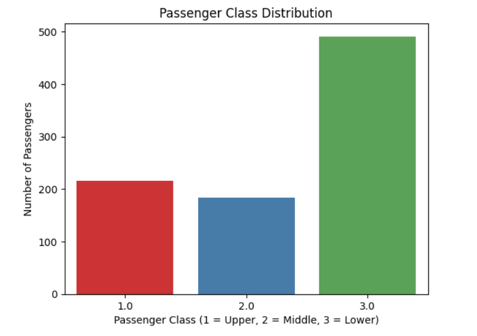

# CSI_WEEK3_MS

# 🛳 Titanic Dataset - Data Visualization (Google Colab Project)

This project performs Exploratory Data Analysis (EDA) and visualization on the famous **Titanic dataset** using Python in Google Colab. The goal is to uncover hidden insights about survival patterns based on various features such as age, gender, class, and family size.

## 📁 Dataset Used

- **Filename**: `Titanic-Dataset.csv`
- **Source**: Kaggle
- The dataset includes information on:
  - Passenger class, age, sex
  - Number of siblings/spouses (`SibSp`) and parents/children (`Parch`)
  - Survival status

---

## 📊 Visualizations Included

### ✅ 1. Passenger Class Distribution
- Shows the number of passengers in each class (1 = Upper, 2 = Middle, 3 = Lower)
- **Visualization**:
  
  

### ✅ 2. Survival by Gender
- Compares male and female survival counts

### ✅ 3. Survival by Age Group
- Age groups like: Child, Teenager, Adult, Middle-aged, Senior

### ✅ 4. Survival by Family Size
- Combines `SibSp` and `Parch` to analyze survival chances with/without family

### ✅ 5. Correlation Heatmap
- Displays relationships between numerical variables

---

## 🛠️ Tools & Libraries Used

- **Python 3**
- **Google Colab**
- **Pandas** for data manipulation
- **Seaborn & Matplotlib** for data visualization

---

## 🚀 How to Run This Notebook

1. Open the notebook in Google Colab:  
   📎https://colab.research.google.com/drive/1kxdSt1fqI9lOE2o2n8INklSWv2aCitpU#scrollTo=RUnppN7Ck24m

2. Upload the dataset `Titanic-Dataset.csv` to the Colab file system.

3. Run each cell to generate all visualizations interactively.

---

## 📌 Insights from Analysis

- Most passengers belonged to the **third class (lower class)**.
- **Women and children** had a higher survival rate.
- **Passengers traveling with small families** had better survival odds than those alone or in large groups.

---

## 🧠 Author

- **Name**: *MANIKA SARKAR*
- **GitHub**: github.com/Manika7777

---

